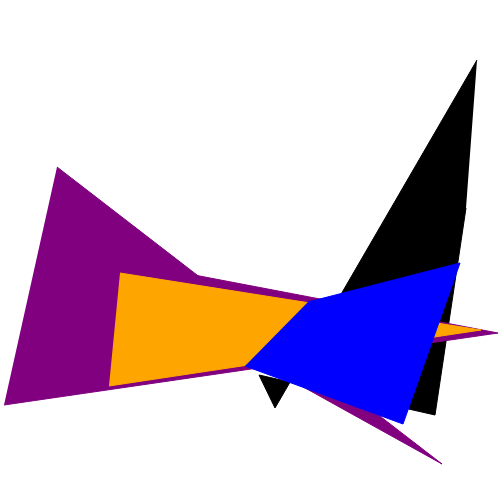
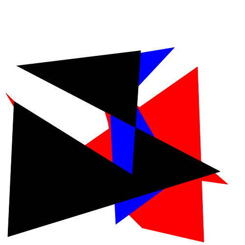

#  OnChainNFTS

 

 

### This repo contains a smart contract project, in which NFTs are created that have all metadata on-chain and are created with verifiably random SVG paths:
- In the first contract `SVGNFT`; a simple SVG is used to create NFTs with all their metadata on chain
- In the second contract `RandomSVGNFT`; chainlink's VRF is used to create randomly generated SVGs, that are the images for NFTs with all their metadata on chain

The project is made with the hardhat framework, utilising javascript to deploy and test

### Deployment
- The contracts are deployed to the Rinkeby test network

### Made with
- Solidity
- Hardhat
- Javascript

### This repo is inspired by;
- [PatrickAlphaC/all-on-chain-generated-nft](https://github.com/PatrickAlphaC/all-on-chain-generated-nft)
